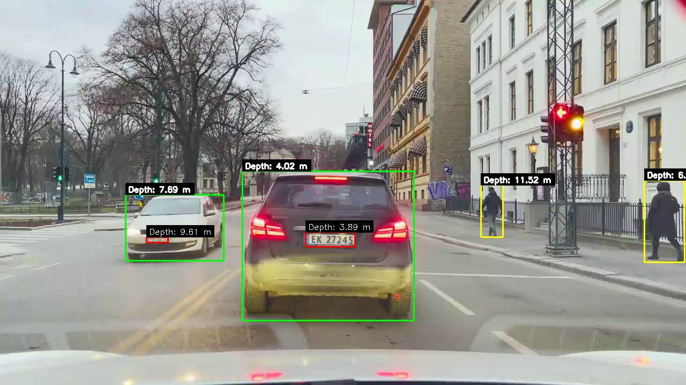

# Introduction
Monocular depth estimation in computer vision is the problem of extracting depth information of a scene from single images captured by monocular cameras.
This is a challenging problem because the ability to perceive depth is achieved through stereo vision, which adds a constraint to the problem of estimating the depth.
In contrast, monocular depth estimation is an ill-posed problem, since we attempt to infer depth information of a scene using only visual cues of a single image.
Most modern approaches to monocular depth estimation involves using large datasets with labeled images to train deep learning models, where the ground truth depth information for each sample is included in the training set.
A popular model that does this is MiDaS, which is trained on up to 12 different datasets, and predicts the relative depth map for a given image.
However, the predicted depth maps only offer depth information up to scale, meaning that we face the issue of scale-ambiguity.
Some work has been done on attempting to learn the absolute depth of a scene, a notable example being ZoeDepth.
ZoeDepth attempts to learn depth information while also maintaining the metric scale.
After testing ZoeDepth however, we find that the accuracy of the model in predicting the true scale is generally poor.

In this project we attempt to tackle the problem of scale-ambiguity in estimated depth-maps by leveraging prior knowledge of the real world geometry of the scene.
As a proof of concept, we apply this idea to traffic footage, where the goal is to get good distance estimates from a dash-camera to any object in the scene.
We use the license plates with standardized real world dimensions as our prior knowledge, and use object detection to find the image dimensions of the plate.



# Usage
To use the script, you need to provide the following parameters in `main.py`

- `WEBCAM`: Set True if using webcam, otherwise use video file
- `VIDEO_PATH`: Path to the video file
- `camera_matrix`: Camera calibration matrix
- `dist_coeffs`: Camera distortion coefficients

The following parameters can be changed from its default values

- `frame_rate` : How many frames per second do we want to include, default is 30
- `OFFSET` : Add offset to focal length to further calibrate based on ground truth measurments of distance to the plate, default is 0.0
- `DEVICE` : Uses CPU by default, change to 'cuda:0' for GPU. 
- `CONFIDENCE_THRESHOLD` : Only show detections with confidence above this threshold, default is 0.75

If using CPU, use the MiDaS\_small model in `main.py`, DPT\_Large and ZoeDepth are too slow on CPU:
```python
depth_estimator = DepthEstimator(model_type='MiDaS_small', device=DEVICE)
```
If using GPU, use ZoeDepth for best quality depth maps if its not too slow, otherwise DPT_Large is a good option.
```python
# ZoeDepth
depth_estimator = DepthEstimatorZoe(model_type='K', device=DEVICE)
# Or DPT_Large
depth_estimator = DepthEstimator(model_type='DPT_Large', device=DEVICE)
```
